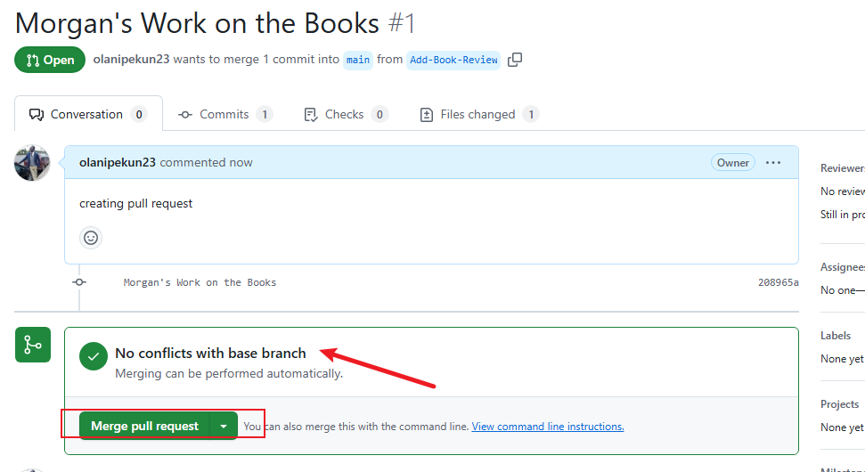

 # *GREENWOOD-LIBRARY-WEBSITE*

 ## DESCRIPTION

 ## Capstone Project: on Improving Community Website library

 This project highlights the skills and knowledge I have gained during the Git Operations course, showing my ability to manage version control system with the concept of who does what when effectively and collaborate in a development environment. It includes creating and managing branches to isolate feature development, staging, committing, and pushing file changes from the local repository to the remote repository. Detailed snapshots are provided as evidence of the commands executed and tasks performed, ensuring thorough documentation and transparency. This capstone project solidifies my understanding of Git as a vital tool for software development and collaboration.

STEP BY STEP ANALYSIS OF THE OPERATION

1 CREATING REPOSITORY

- Click on the GitHub Remote Repos copy the url and CLONE on the git bash.

 

- Make a directory for Project using ```mkdir```


- Open The directory in your git bash and run: ```git clone``` (insert remote repository link)


The output or result of the git clone command.

 
 This is the cloned repository and the directory path.
 

2 CREATING FILES

- Open your VSCODE  from Git bash using ```code .```


- Click on File Icon and then click on new file to create the html file.


4 html files created on the main repo.


- add content or code or sample text.


- Then you stage, commit, push Changes to the main branch:

To stage.


To Commit


To Push


# **MORGAN'S WORK**

1 Created Morgan's branch and switched to it using ```git checkout -b``` to add Add-Book-Review branch


- Created book review.html file


opened it in vscode.


added content in vscode


2 Stagged, commit and pushed it to Add-Book-Review branch.


- after the push you check the status


3 Raise Pull Request for MORGAN'S work.


- then the merge pull request




- Updated in the main Branch.


# **JAMIE'S WORK** (updating event page)

1 Used the ```git checkout -b``` command to create another branch for Jamie's work.


- created content using vscode.


2 Then use Git add, to stage, git commit, to commit and git pusn to push


- Then create a PULL REQUEST


- Then you create a merge request


- Merge successful


- Then we check the Remote Repository Update on Jamie's work (Update Events)

